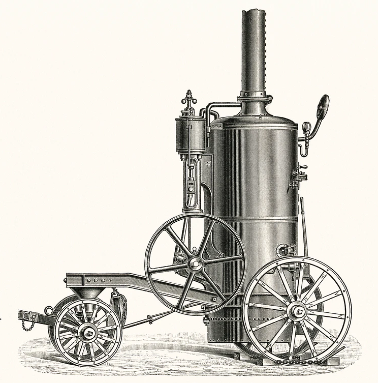

# Rust by example: asn-db and asn-tools

Rust features by example with `asn-db` and `asn-tools` crates.

© 2020 Jakub Pastuszek. Some Rights Reserved. The content of this presentation is licensed under the [Creative Commons Attribution 4.0 License](https://creativecommons.org/licenses/by/4.0/) and presented source code licensed under the [MIT license](https://opensource.org/licenses/MIT).

## Code presentation

In this presentation, I will go through the source code of asn-db and asn-tools crates.
I will explain their structure and basic Rust features according to the plan outlined here.
This will be a 10000-foot view on programming in Rust.

Questions are welcome.

## Autonomous Systems number database

 * What is ASN
 * [IPtoASN](https://iptoasn.com/) website and database files
 * `asn-db` and `asn-tools`
 * `asn-lookup` command demo
 * Post about the presented crates: https://jpastuszek.net/asn/

## Rust crates

 * Library vs binary crate
 * Binary crates with library code
 * Contents of the `Cargo.toml` file
 * Using libraries with `cargo add` (`cargo install cargo-edit`)

## Compiling and running

 * `cargo check`, `cargo build`, `cargo install` and `cargo run`
 * Running tests with `cargo test`

## Crates documentation

 * Module level
 * Item level
 * Comments

## Imports

 * Modules in Rust
 * Visibility
 * Re-exports

## Global variables

 * `const` expressions, "life before main", `lazy_static!` and ongoing work on const generics
 * Literal string vs literal binary string
 * UTF-8 encoding of source files

## Type in Rust

 * Primitive types
 * `structs`, tuples and named tuples
 * `enum` sum type
 * Functions and closures are first class objects

## Functions, methods and traits

 * Free functions
 * Methods and functions associated with types
 * Implementing traits and default implementations

## Deriving trait implementations

 * Deriving `Debug` and `Clone` trait
 * Manual implementation of `PartialEq` and `Eq` derive
 * Deriving `Serialize` with `serde_derive` procedural macros

## Implementing custom error types

 * `Result` type
 * `Error` trait and implementation
 * `From` trait and implementation
 * `?` operator and de-sugaring

## Iterators

 * `Option` type
 * `.next()`
 * Iterator composability and zero-cost performance
 * Creating iterators with `IntoIterator` trait
 * Consuming iterators with `collect` and "turbofish" type annotations

## CSV parsing

 * Builder pattern
 * `Read` trait and I/O in rust
 * Type parametrisation
 * Trait bounds and `impl`
 * Lifetime parametrisation

## Serialization

 * `Write` trait
 * Writing and reading data with `serde` crate

## Panics

 * Aborting and unwinding
 * Explicit `panic!()` and implicit panic with `[]` index operator
 * Panic safety of libraries

## Testing

 * Writing unit tests
 * Running tests
 * Note on parallel execution

## Command-line applications

 * Multiple binaries
 * `main` function and its return type
 * Accessing arguments and environment

## Parsing command-line arguments with `StructOpt`

 * `StructOpt` and `clap` crates
 * Annotating arguments
 * Accessing values
 * Help message

## Input and output

 * Printing to `stdout` and `stderr`
 * Logging with `log` crate
 * Reading from `stdin`

## Dynamic types

 * References, `Sized` trait and stack
 * Heap allocations and `Box` reference
 * Trait objects and `dyn`
 * `vtable` and zero cost abstraction

## Thank you!

 * Q & A
